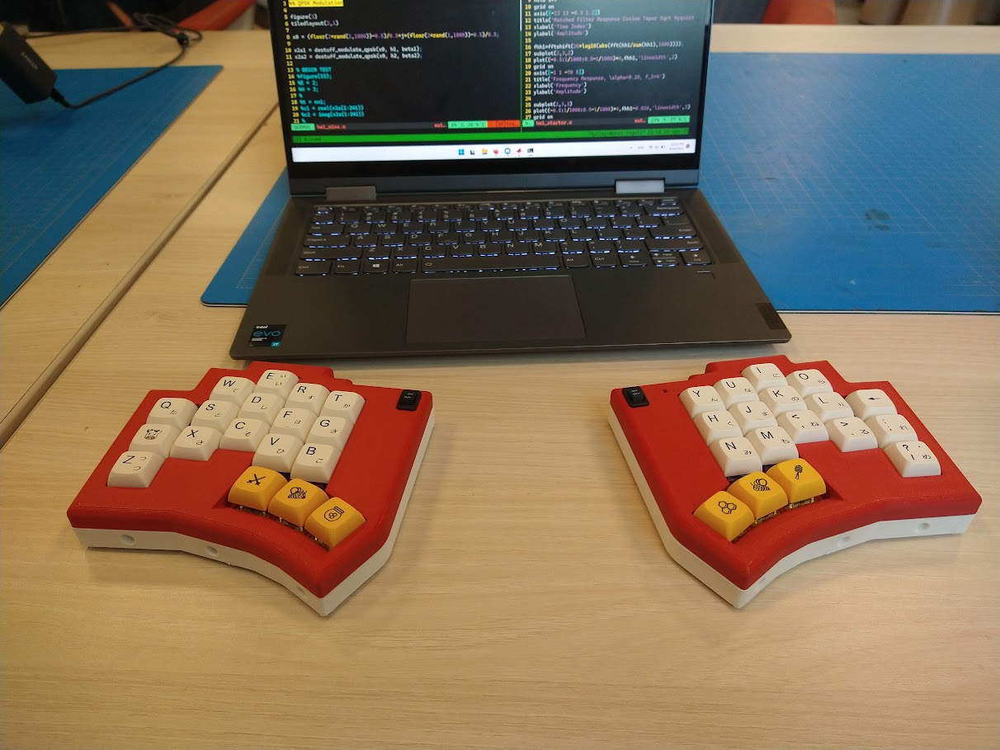
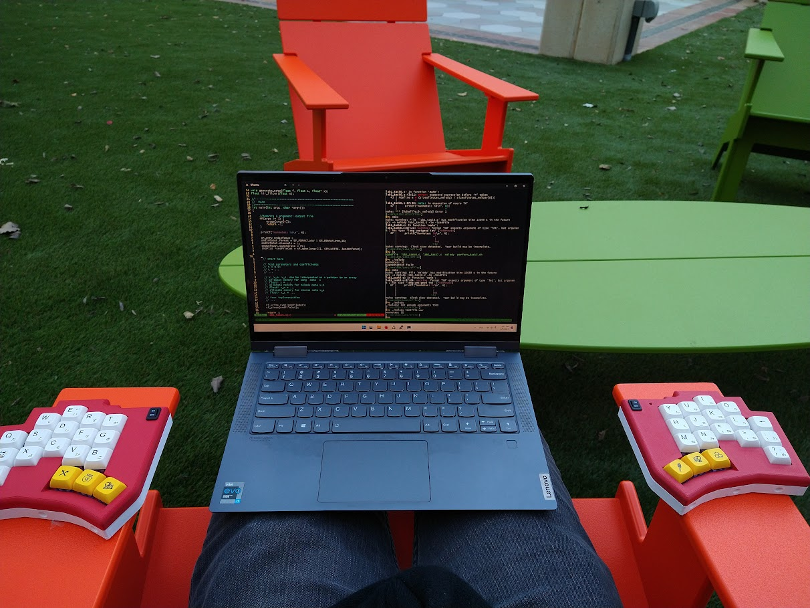
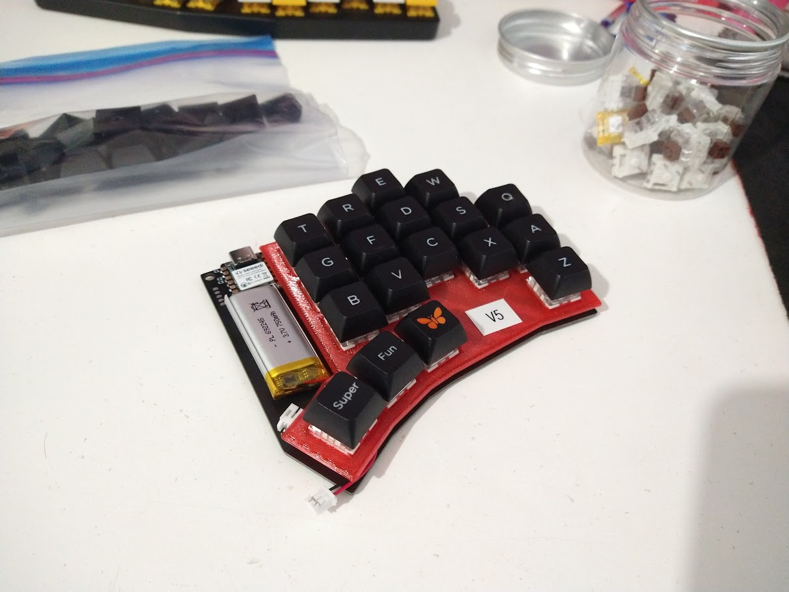

# Harold Keyboard

A fully-split fully-wireless keyboard that I made for myself. Powered by ZMK, a 750mAh LiPo, and an Seeeduino XIAO NRF52840.

## Repository Files

`config` has the zmk config files.
`hardware/ergogen` has the [Ergogen](https://github.com/ergogen/ergogen) files that were used to generate PCB Layout.
`hardware/pcb` has the KiCAD PCB files.

## Pictures

This is my favorite use case: Comfy Coding

This is what it looks like under the hood:

